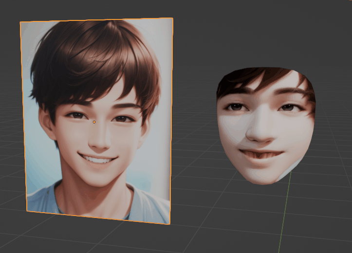
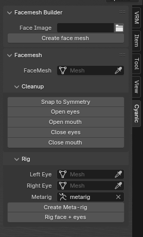
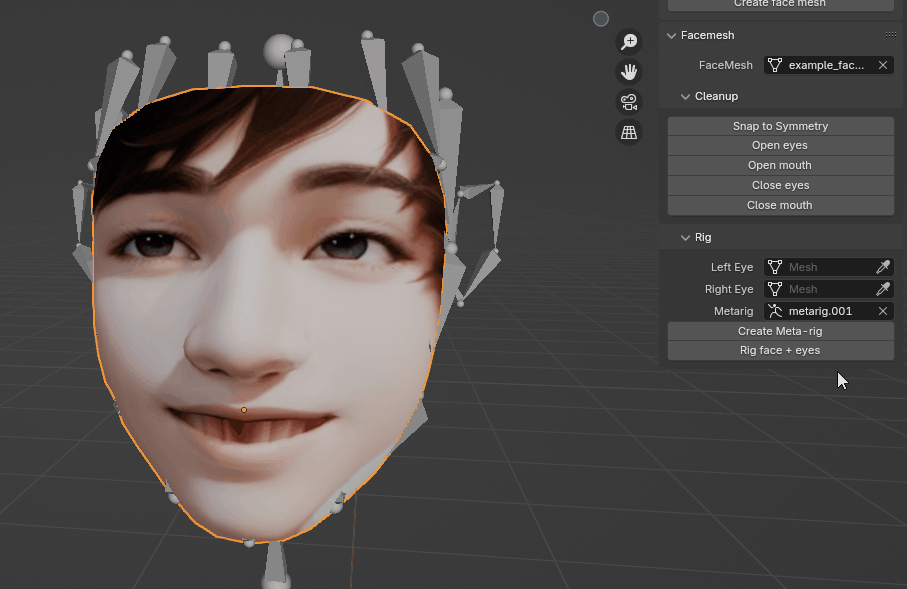
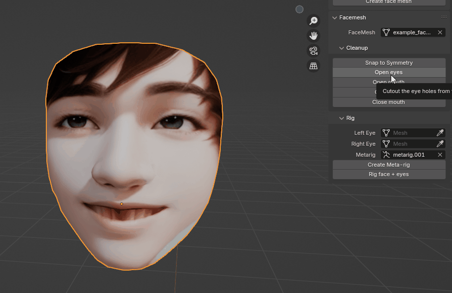
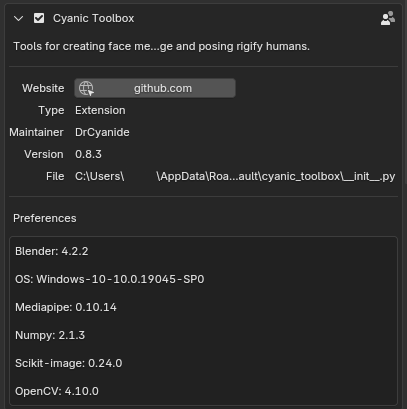

# Cyanic Toolbox
This Blender Add-on allows for you to quickly make a 3D face mesh from a 2D image, touch up that face mesh, and align Rigify bones to it.

## Install
* Download the [latest release](https://github.com/DrCyanide/cyanic_toolbox/releases)
* In Blender 4.2 or newer go to `Edit` > `Preferences` > `Add-ons`, then in the upper right click the down arrow and choose `Install from Disk`. Then navigate to the saved zip folder and click the `Install from Disk` button
* Search for "Cyanic Toolbox" and make sure there's check the box next to it
* In the 3D workspace, `Cyanic` should show up in your Layout's sidebar menu

## Use
* In the "Facemesh Builder" section, select the filepath for an image with a face - ideally a JPG but sometimes PNGs have the correct formatting to work
* Click the "Create face mesh" button
* The generated .obj will be automatically imported into the scene. By default, this generated file (and it's texture) are saved in the same directory as your source image
* The "Rig Face + Eyes" will align Rigify Meta-rig bones with their closest matching vertex in the face mesh (and the eye bones to the origin of the eye meshes). IT DOES NOT PARENT ANYTHING! That has to be done after you generate a rig from the meta-rig.

* Cleanup tools like "Open eyes" and "Open mouth" can make it easier for adding higher quality 3D eyes/teeth

* "Snap to Symmetry" is easy access to the Blender function with the same name. Sometimes it works great, other times it needs some help
* "Eyes to Sockets" positions your eye meshes so their origin (usually center) is directly centered in the eye socket.
* "Parent Eyes to Rig" parents the eyes to the MCH-eye bones in the generated rig. 
* "Undo" and "Redo" commands should work as expected

## MOCAP DOES NOT WORK YET

Mediapipe 3D Pose Estimation from 2D image/video is highly desirable feature, but it takes a lot of math that I need to study before I can make it a reality.

## Troubleshooting

* If you get an error that says `DLL load failed while importing _framework_bindings: A dynamic link library (DLL) initialization routine failed.` - This likely means you have [BlendARMocap](https://github.com/cgtinker/BlendArMocap) installed. Please uninstall (not just disable) it and any other add-on that uses Mediapipe. 

* If you updated to a newer version of Blender and Cyanic Toolbox is no longer working, try uninstalling and reinstalling the addon. If there is no uninstall button for the addon, try deleting the folder `%appdata%\Blender Foundation\Blender\<newer version>\extensions\user_default\cyanic_toolbox` and re-installing the addon. 

If you're still having issues, please take a screenshot of the details in the Add-ons menu. The most common causes of problems will show up here.

## (Optional) Build this project yourself

If you're interested in programming more features (or impatient for the next release, or wanting to release on a different platform), you'll need to be able to build this project yourself to test it. Here's the basic steps.

1) Run `python wheel_dl.py` to download the required Python Wheel files to your system. These are the dependency libraries that this add-on needs to operate. Blender will basically `pip install` these files.
2) Update `blender_manifest.toml` to a new `version` number. If you edited the dependencies (or if the previous step downloaded different dependencies), update the `wheels =` list to include the new dependencies. If you're adding support for a new operating system, make sure it's included in the `platforms =` list.
3) Add Blender to your system path and run `blender --command extension build --split-platforms`. This will create a new zip of the project which can be installed the same as a release.